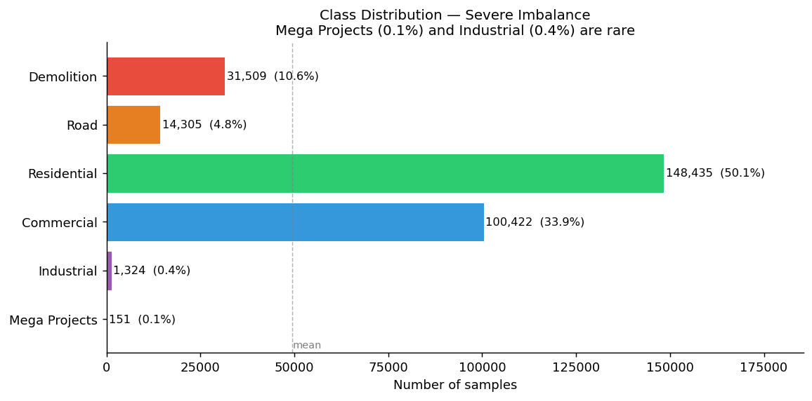
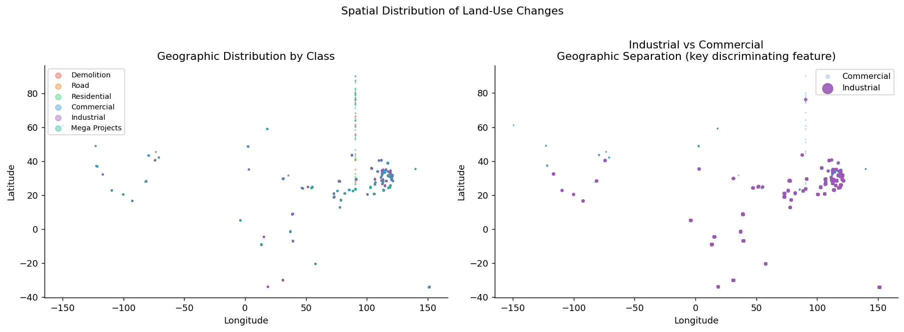
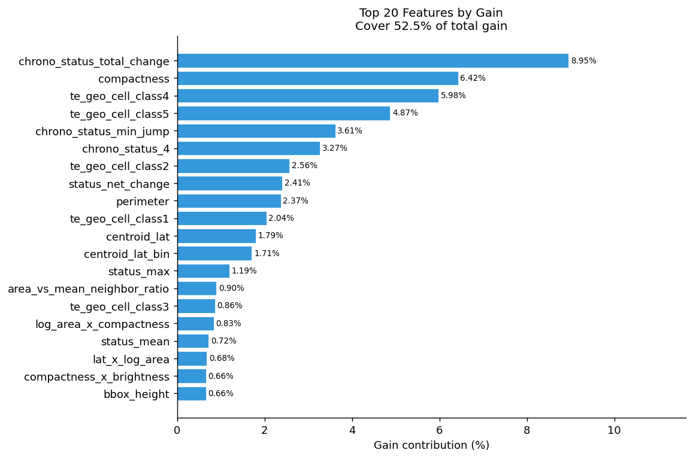
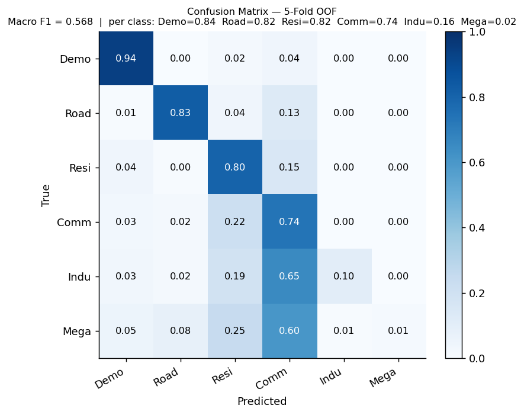
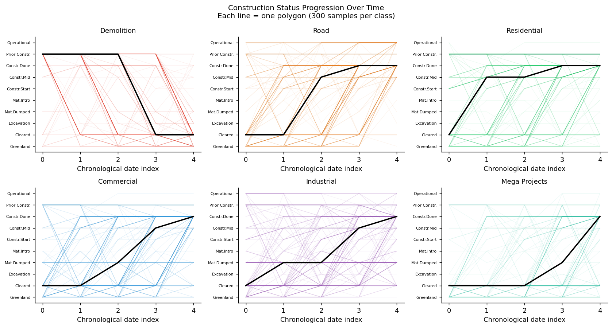
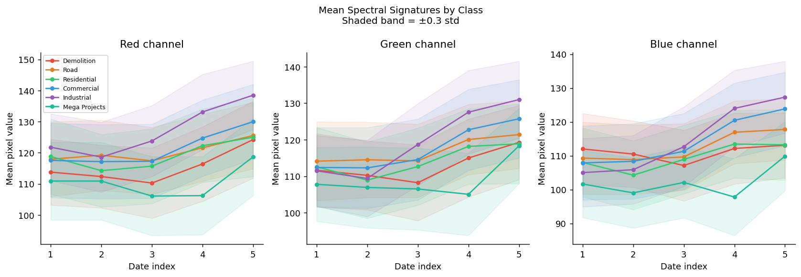

# Land-Use Change Classification from Satellite Imagery

Multi-class classification of geographical areas from multi-date satellite imagery features.  
Course competition — CentraleSupélec · Jan–Feb 2026 · **Private leaderboard: 0.899 macro F1** (baseline kNN: 0.40)

---

## Problem

Given a geographical polygon observed across **5 satellite dates**, classify its land-use change into one of 6 categories:

| Class | Label | Train samples | Share |
|---|---|---|---|
| Residential | 2 | 148,435 | 50.1% |
| Commercial | 3 | 100,422 | 33.9% |
| Demolition | 0 | 31,509 | 10.6% |
| Road | 1 | 14,305 | 4.8% |
| Industrial | 4 | 1,324 | 0.4% |
| Mega Projects | 5 | 151 | 0.1% |

**Key challenges:**
- Severe class imbalance (Mega Projects = 0.1% of training data)
- 296,146 training polygons, 120,526 test polygons
- Raw input: polygon geometry + RGB satellite statistics per date + categorical status labels
- Evaluation metric: macro F1-score (rare classes penalise equally to majority ones)

<p align="center">
  
</p>

---

## Approach

### 1. Feature Engineering (~600 features from raw input)

The raw data provides polygon geometry, 5-date RGB statistics, categorical status labels, and neighbourhood descriptors. All features were hand-crafted — no pre-trained embeddings.

**Geometric features**
- Area, perimeter, compactness (4πA/P²), convexity, elongation, fill ratio
- Bounding box dimensions and aspect ratio
- Log-area, area buckets, area rank percentile

**Spectral features** (per date × 5 dates)
- Raw RGB means and standard deviations
- Spectral indices: GRI, BRI, VARI, EXG, RGI (vegetation and soil proxies)
- Temporal deltas between consecutive dates
- Overall mean, std, and range across all dates

**Temporal features**
- Dates sorted chronologically (the 5 dates are unordered in the raw data)
- Time deltas between consecutive observations, total time span
- Status labels reordered chronologically → progression patterns

**Status features**
- Ordinal encoding of 10 construction states (Greenland → Operational)
- Net change, monotonicity, max/min jumps, number of reversals
- Targeted patterns: `demolition_pattern` (Prior Construction → Greenland), `road_pattern`

**Spatial neighbourhood features** (cKDTree on projected centroids)
- Distance to nearest neighbour
- Number of polygons within 500m and 1km
- Mean and std of neighbour areas, fraction of large neighbours (> 5,000 m²)
- Key insight: Industrial zones have ~4× more neighbours per km² than Commercial (Cohen d = 0.77)

**Target encoding** (fold-aware, anti-leakage)
- Urban type, geography type, construction status, and geographic cell (0.05° bins)
- Computed only on out-of-fold data during CV to prevent label leakage

<p align="center">
  
</p>

### 2. Model

**XGBoost** (`multi:softprob`, histogram method) outperformed LightGBM and CatBoost on this dataset.

```python
params = dict(
    max_depth        = 10,
    min_child_weight = 3,
    subsample        = 0.9,
    colsample_bytree = 0.9,
    learning_rate    = 0.05,
    n_estimators     = 10000,   # full retrain
)
```

**Class weighting** to handle imbalance — manual weights tuned by class frequency:

```python
class_weights = {
    "Demolition": 1.3, "Road": 2.8, "Residential": 0.27,
    "Commercial": 0.40, "Industrial": 30.0, "Mega Projects": 265.0
}
```

**Feature selection** — from ~600 engineered features, the top 318 by cumulative gain (99.5% of total gain) are used. Features with zero importance are dropped.

<p align="center">
  
</p>

### 3. Validation

**5-fold stratified cross-validation** with out-of-fold (OOF) predictions provides the primary evaluation signal. Each polygon is predicted exactly once on a fold it was never trained on.

> The competition allowed submitting directly to Kaggle for feedback. However, using the public leaderboard as a validation proxy leads to implicit overfitting on the public test set. The OOF F1 score is the honest measure of generalisation on the training distribution.

---

## Results

### OOF Performance (5-fold stratified CV)

| Class | Precision | Recall | F1 | Support |
|---|---|---|---|---|
| Demolition | 0.763 | 0.940 | 0.843 | 31,509 |
| Road | 0.823 | 0.826 | 0.824 | 14,305 |
| Residential | 0.837 | 0.802 | 0.819 | 148,435 |
| Commercial | 0.737 | 0.737 | 0.737 | 100,422 |
| Industrial | 0.398 | 0.105 | 0.166 | 1,324 |
| Mega Projects | 0.125 | 0.013 | 0.024 | 151 |
| **Macro F1** | | | **0.569 ± 0.008** | |

Log-Loss OOF: 0.618. Std across folds: ±0.008 — instability driven by the rare classes (Industrial, Mega Projects).

### Kaggle Leaderboard

| Split | Score |
|---|---|
| Public (30% of test) | 0.974 |
| **Private (70% of test)** | **0.899** |

The gap between OOF (0.568) and Kaggle private (0.899) has two likely causes. First, the **full retrain** uses 100% of the training data (296,146 examples) versus ~80% per fold in CV (237,000 examples), which directly benefits the rare classes — with 265× weight on Mega Projects (151 examples), the difference between 120 and 151 training examples is non-negligible. Second, a **distribution shift** in the test set: rare classes (Industrial, Mega Projects) appear to be easier to classify or less prevalent. The public/private gap (0.974 → 0.899) reflects leaderboard overfitting from iterative submissions.

<p align="center">
  
</p>

### Main Error Patterns

The confusion matrix reveals three dominant failure modes:

1. **Residential ↔ Commercial confusion** — 15% of Residential predicted as Commercial, 22% of Commercial predicted as Residential. These two classes share construction timelines and spectral profiles; they are only separable through fine-grained geographic and neighbourhood features.

2. **Industrial → Commercial** — 65% of Industrial polygons (854/1,324) are predicted as Commercial, with high confidence (mean 0.873). The model is confident but wrong: the median probability assigned to the true Industrial class on genuine Industrial examples is only 0.006. This is the main bottleneck for macro F1.

3. **Mega Projects — near-complete failure** — only 2 out of 151 examples correctly identified (F1 = 0.024). The model assigns a median probability of 0.0001 to the Mega Projects class on true Mega Projects examples, suggesting the class is essentially invisible to the model in CV conditions.

---

## Analysis

### Why Industrial is hard

Cohen d analysis shows that the strongest discriminant between Industrial and Commercial is **geographic** (latitude, d = 1.26), not spectral (RGI, d = 0.36). Industrial zones at similar latitudes to Commercial zones are nearly indistinguishable from features alone. New features targeting neighbour density (`area_per_neighbor_1km`, `lat_x_n_neighbors`) were added to address this.

<p align="center">
  
</p>

### Why Mega Projects is hard

With only 151 training examples, the model assigns a median probability of 0.0001 to Mega Projects on true positive examples — essentially noise. Class weights of 265× partially mitigate this, but the signal-to-noise ratio is fundamentally limited by the sample size. The spectral signature (darker across all channels) is real but has Cohen d < 0.5 vs all other classes.

<p align="center">
  
</p>

---

## Reproducing

```bash
# 1. Install dependencies
pip install -r requirements.txt

# 2. Place train.geojson and test.geojson in data/

# 3. Build feature cache (~4 min)
python feature_engineering.py

# 4. Run OOF cross-validation and analysis (~45 min)
python analyze_model.py

# 5. Compute feature importance (requires a trained model)
python feature_importance.py

# 6. Generate submission (full retrain on 100% of training data, ~90 min)
python generate_submission.py

# 7. Generate EDA figures
python eda.py
```

> **Note on `generate_submission.py`:** This script trains on 100% of the training data (a standard competition practice once hyperparameters are fixed via CV). The monitoring metrics (F1 → 1.0) measure fit on training data and are **not** a generalisation estimate. Use `analyze_model.py` for honest evaluation.

---

## File Structure

```
├── feature_engineering.py   # Feature construction pipeline (~600 features)
├── analyze_model.py         # 5-fold OOF cross-validation + error analysis
├── feature_importance.py    # XGBoost gain-based feature ranking
├── generate_submission.py   # Full retrain for Kaggle submission
├── eda.py                   # Exploratory data analysis figures
├── features_to_keep.txt     # Selected features (99.5% cumulative gain)
├── feature_importance.csv   # Feature rankings
├── requirements.txt
└── results/
    └── figures/             # EDA and analysis plots
```
